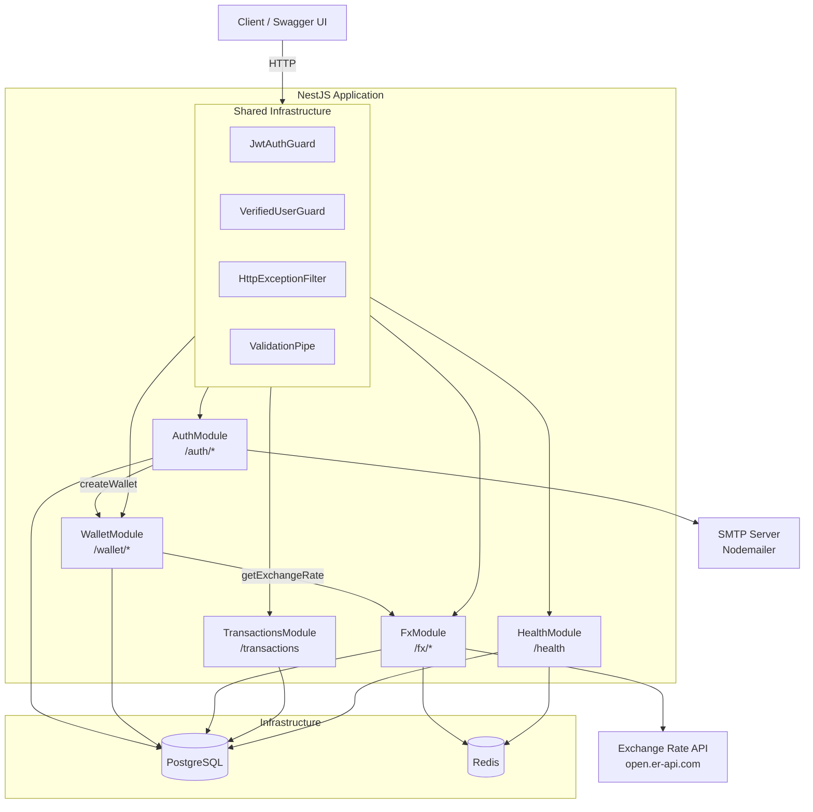
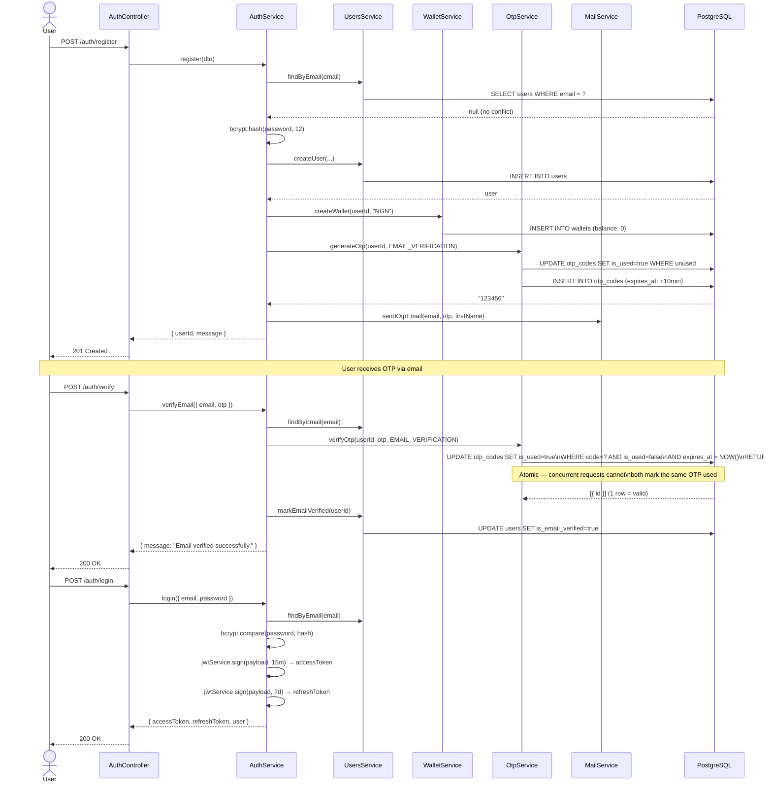
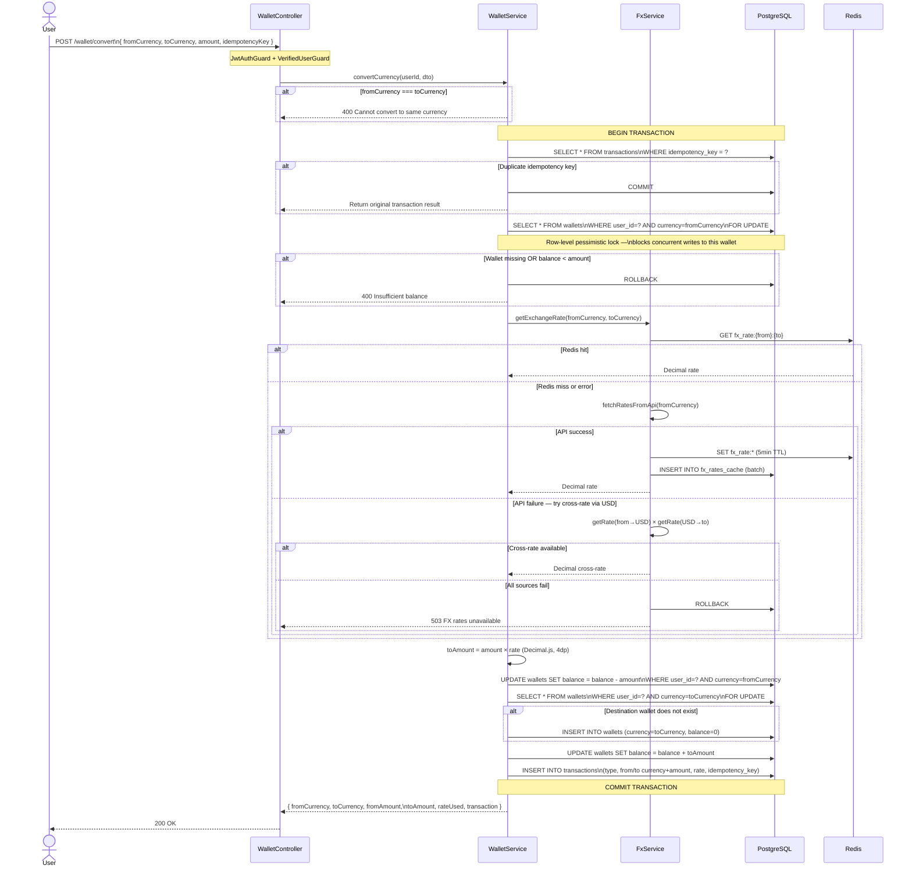
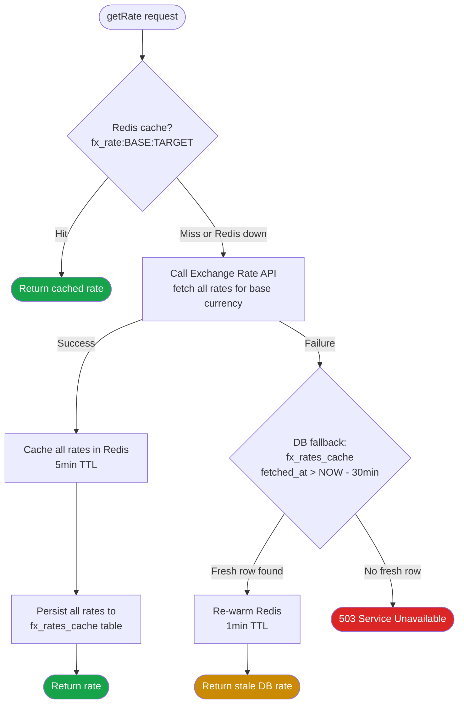
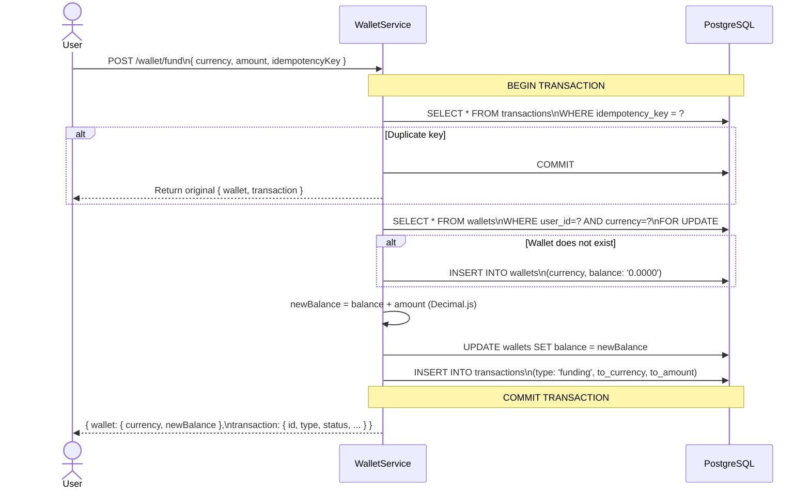
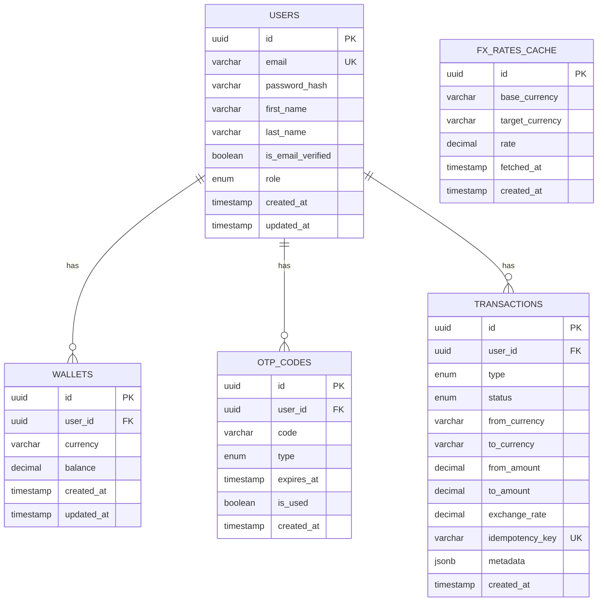

# Architecture & Flow Diagrams

---

## 1. System Architecture Overview

The application is a NestJS monolith with seven domain modules backed by PostgreSQL and Redis. All wallet and trading operations go through shared guards before reaching the relevant module.

---

## 2. User Registration & Verification Flow

Registration creates a user, seeds their NGN wallet, and sends an OTP. Verification uses a single atomic `UPDATE … RETURNING` to prevent two concurrent requests from both succeeding on the same OTP.

---

## 3. Currency Conversion Flow

The most critical path in the system. The entire operation — idempotency check, balance validation, rate fetch, debit, credit, and transaction record — runs inside a single PostgreSQL transaction with pessimistic row-level locks.

---

## 4. FX Rate 3-Tier Caching Strategy

Rate lookups cascade through three tiers. On a successful API fetch, all rates for the base currency are persisted to both Redis and the DB in one go. On DB fallback, the stale rate is re-warmed into Redis with a shorter 1-minute TTL.

---

## 5. Wallet Funding Flow

Funding is simpler than conversion — no rate fetch needed — but uses the same QueryRunner transaction pattern with an idempotency guard and pessimistic lock.

---

## 6. Entity Relationship Diagram

Five tables. `users` is the root entity. `wallets` enforces a unique `(user_id, currency)` constraint — the vertical wallet model. `transactions` covers funding, conversions, and trades in a single table differentiated by `type`.

